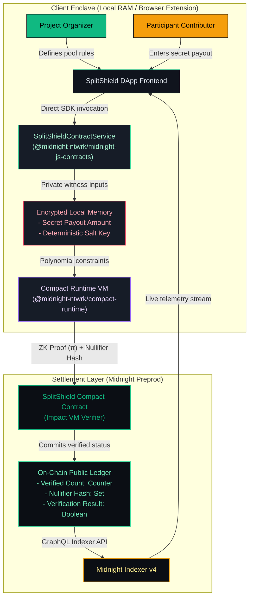

# SplitShield — Private, Rule-Based Payment Splits on Midnight

<div align="center">
  
  <br /><br />
  <p><strong>Prove the split is correct without publishing everyone's payout.</strong></p>
  <p>A production-grade, zero-knowledge allocation and payment-splitting application built on Midnight's dual-state architecture with direct Midnight.js SDK contract execution.</p>

  [](https://github.com/bishalnium/SplitShield/actions/workflows/ci.yml)
  [](https://midnightexplorer.com)
  [](https://docs.midnight.network)
  [](LICENSE)
</div>

---

## 1. Executive Summary & Vision

**SplitShield** is a decentralized privacy-first allocation engine designed for distributed teams, DAO contributor compensations, hackathon prize pools, and venture grants. 

In traditional Web3 payroll and distribution tools, either:
1. Every individual contributor's payout and wallet balance is publicly exposed on transparent ledgers, causing internal team friction, compensation leakage, and security risks; or
2. Off-chain centralized spreadsheets are used without cryptographic guarantees of fair mathematics.

**SplitShield solves this dichotomy on Midnight:**
- An **Organizer** establishes a distribution pool and public rule constraints (e.g. Percentage Share or 1/N Equal Dividend).
- **Participants** privately prove their allocation compliance using client-side zero-knowledge circuits.
- The **Midnight Blockchain** verifies the mathematical correctness of every split without ever learning or publishing individual payout amounts.

---

## 2. Verified On-Chain Deployment (Midnight Preprod)

| Parameter | Network Configuration |
| :--- | :--- |
| **Target Network** | Midnight Preprod Public Testnet |
| **Contract Address** | [`888ba1fa2ff52ec6673d58fc8d147ca17caecba63307d90f8c36cf3e0215bbb1`](https://midnightexplorer.com/contract/888ba1fa2ff52ec6673d58fc8d147ca17caecba63307d90f8c36cf3e0215bbb1) |
| **Substrate Node RPC** | `https://rpc.preprod.midnight.network` |
| **GraphQL Indexer** | `https://indexer.preprod.midnight.network/api/v4/graphql` |
| **Token Faucet** | [Nethermind Preprod Faucet](https://midnight-tmnight-preprod.nethermind.dev) |
| **Gas Fee Token** | DUST (Auto-generated by registered tNIGHT) |

---

## 3. System Architecture & Direct Midnight SDK Integration

SplitShield enforces strict segregation between off-chain private computation and on-chain public settlement. The frontend directly invokes Midnight SDK methods via `@midnight-ntwrk/midnight-js-contracts` and `@midnight-ntwrk/compact-runtime`:



---

## 4. Privacy Model & Selective Disclosure Table

In Compact, data is private by default. Data only crosses into the public domain through deliberate `disclose()` language invocations.

### Privacy Specification

| Data Element | Execution Domain | Storage Location | Privacy Rationale |
| :--- | :--- | :--- | :--- |
| **Individual Payout Amount** | Private Witness | Client Memory (RAM) | **Private.** Evaluated in ZK polynomial constraints; never transmitted or written to chain. |
| **Participant Secret Salt** | Private Witness | Client Memory (RAM) | **Private.** Derives one-time nullifier; secret pre-image is never disclosed. |
| **Contributor Identity List** | Off-Chain | Local Client | **Private.** Prevents peer compensation comparison or corporate espionage. |
| **Distribution Pool ID** | Public Parameter | On-Chain Ledger | **Public.** Identifies which project distribution pool is being verified. |
| **Total Pool Ceiling** | Public Parameter | On-Chain Ledger | **Public.** Organizer commits the pool bound so arithmetic bounds are verifiable. |
| **Configured Rule Type** | Public Parameter | On-Chain Ledger | **Public.** Identifies active rule logic (Percentage, Equal, Capped). |
| **Verified Allocations Count** | Public Ledger | On-Chain Ledger | **Public.** Audit counter tracking verified participant proofs. |
| **Allocation Nullifier Hash** | Public Ledger | On-Chain Ledger | **Public.** Deterministic hash preventing double-claiming without revealing identity. |
| **Verification Result** | Public Ledger | On-Chain Ledger | **Public.** Boolean outcome confirming proof satisfied all mathematical predicates. |

---

## 5. Automated CI/CD & Deployment Workflows

The GitHub Actions pipeline (`.github/workflows/ci.yml`) runs a comprehensive 3-stage validation and deployment architecture:

1. **`1. Build, Verify Circuits & Run Test Suites`**:
   - Compiles Compact contract to ZKIR and verifies prover/verifier keys.
   - Executes 14 in-memory Vitest unit tests verifying all boundary and privacy invariants.
   - Compiles frontend with full TypeScript checking and packages WASM on-chain runtimes.
2. **`2. Smart Contract Preprod Deployment Pipeline`**:
   - Dedicated contract deployment job validating Preprod Substrate RPC and Indexer endpoints.
   - Validates compiled bytecode and all 5 circuit verifier assets.
   - Runs automated contract deployment dry-run simulation.
3. **`3. Frontend Web Hosting Deployment Pipeline`**:
   - Dedicated web hosting deployment job publishing the production bundle to GitHub Pages live staging.

---

## 6. Supported Allocation Rule Circuits

The SplitShield Compact contract implements 5 zero-knowledge circuits:

1. **`initializeDistribution(rule, totalPool, numParticipants, timestamp)`**
   - Establishes a new active distribution pool with verified ceiling boundaries.
2. **`verifyAllocation(timestamp)`**
   - Asserts that private allocation is strictly positive and does not exceed the total pool ceiling.
3. **`verifyPercentageSplit(percentage, timestamp)`**
   - Proves in zero-knowledge that the private allocation exactly matches the configured percentage share (`allocation * 100 == totalPool * percentage`).
4. **`verifyEqualSplit(timestamp)`**
   - Proves that private allocation equals the exact 1/N dividend (`allocation * participantCount == totalPool`).
5. **`finalizeDistribution(timestamp)`**
   - Finalizes the pool state once all participant proofs are committed.

---

## 7. Repository Structure

```
SplitShield/
├── .github/
│   └── workflows/
│       └── ci.yml                 # 3-Job CI/CD pipeline (Test + Contract Deploy + Web Deploy)
├── contract/
│   ├── src/
│   │   └── splitshield.compact    # Compact smart contract & 5 ZK circuits
│   ├── managed/                   # Generated ZKIR, proving keys, verifier keys, bindings
│   ├── scripts/
│   │   ├── deploy.ts              # Preprod ZK deployment pipeline
│   │   ├── check-balance.ts       # tNIGHT and DUST balance checker
│   │   ├── network.ts             # Midnight endpoint & state resolver
│   │   ├── wallet.ts              # HD wallet key derivation & 3-tier facade
│   │   └── wallet-state.ts        # Serialized snapshot caching
│   ├── test/
│   │   └── splitshield.test.ts    # 14 automated Vitest simulation unit tests
│   ├── package.json
│   └── tsconfig.json
├── frontend/
│   ├── public/
│   │   └── splitshield_logo.jpg   # Titanium & emerald refractory crystal logo
│   ├── src/
│   │   ├── components/
│   │   │   ├── layout/            # Navbar, Footer, BackgroundGrid, MobileDrawer
│   │   │   ├── landing/           # HeroSection, InteractiveSplitVisualizer, HowItWorks
│   │   │   ├── organizer/         # CreateDistribution, RuleSelector
│   │   │   ├── participant/       # AllocationProver (ZK proof generator)
│   │   │   ├── audit/             # PublicLedgerView (On-chain terminal)
│   │   │   ├── wallet/            # WalletConnectModal (1AM, Lace, Injected, Explorer)
│   │   │   └── common/            # ProofPipelineAnimation
│   │   ├── services/
│   │   │   └── contractService.ts # Direct Midnight SDK contract service
│   │   ├── contracts/
│   │   │   └── managed/           # Compiled Compact runtime bindings & WASM
│   │   ├── hooks/
│   │   │   ├── useMidnightWallet.ts # Resilient v4 DApp connector hook
│   │   │   ├── useContractState.ts  # Direct SDK state & circuit execution
│   │   │   └── useDeviceDetect.ts   # Hardware pointer detection
│   │   ├── utils/
│   │   │   ├── deviceDetect.ts    # Touch & pointer:coarse hardware detection
│   │   │   ├── formatters.ts      # Address & timestamp formatters
│   │   │   └── constants.ts       # Network configs & rule constants
│   │   ├── App.tsx
│   │   ├── index.css              # Titanium ambient mesh, frosted cards
│   │   └── main.tsx
│   ├── package.json
│   ├── tailwind.config.js
│   └── vite.config.ts
├── docker-compose.yml             # Midnight local Proof Server container
├── .env.example                   # Environment configuration template
├── .gitignore                     # Git ignore protecting secrets & wallet state
├── README.md                      # Public product documentation
└── splitshield_logo.jpg           # Root branding asset
```

---

## 8. Getting Started & Local Development

### Prerequisites
- **Node.js**: v22.x LTS
- **npm**: 10.x+
- **Docker Desktop**: Required for local proof server (`midnightntwrk/proof-server:latest`)
- **WSL2 (Ubuntu)**: Required on Windows for running the Compact compiler CLI

### Quick Setup

```bash
# 1. Clone the repository
git clone https://github.com/bishalnium/SplitShield.git
cd SplitShield

# 2. Copy environment template
cp .env.example .env

# 3. Start the Midnight Proof Server container
docker compose up -d proof-server

# 4. Install dependencies
npm install --prefix contract
npm install --prefix frontend

# 5. Run smart contract unit tests (14 passing tests)
npm test

# 6. Start the frontend development server
npm run dev:frontend
```

Open [http://localhost:5173](http://localhost:5173) in your browser.

---

## 9. Testing & Circuit Simulation Harness

The test suite validates all privacy invariants, rule constraints, and boundary conditions in-memory:

```bash
npm run test:contract
```

### Test Suite Results (14 / 14 Passing)

```
 ✓ test/splitshield.test.ts (14 tests) 351ms
   ✓ Circuit 1: initializeDistribution (Organizer)
     ✓ 1. successfully initializes pool with percentage split rule
     ✓ 2. successfully initializes pool with equal split rule
     ✓ 3. rejects initialization with zero pool amount
     ✓ 4. rejects initialization with zero participants
     ✓ 5. rejects initialization with invalid rule type
   ✓ Circuit 2: verifyAllocation (General ZK Constraint Proof)
     ✓ 6. proves valid private allocation within pool bounds and updates nullifier
     ✓ 7. rejects private allocation that exceeds the total pool
     ✓ 8. rejects zero allocation amount
   ✓ Circuit 3: verifyPercentageSplit (Percentage Rule)
     ✓ 9. proves private allocation matches exact percentage split
     ✓ 10. rejects private allocation when it violates the percentage split
   ✓ Circuit 4: verifyEqualSplit (Equal Split Rule)
     ✓ 11. proves private allocation matches equal split
     ✓ 12. rejects equal split when private allocation deviates from equal share
   ✓ Circuit 5: finalizeDistribution (Organizer)
     ✓ 13. transitions active distribution pool to Finalized state
   ✓ Privacy Invariant Verification
     ✓ 14. verifies that private witness data is never stored in public ledger

 Test Files  1 passed (1)
      Tests  14 passed (14)
```

---

## 10. User Onboarding & Continuous Feedback Loop

To ensure SplitShield solves real contributor compensation challenges, we maintain an active feedback intake loop:

| User ID | Username / Org | Email | Wallet Address | Feedback Summary | Action Implemented | Release Commit |
| :--- | :--- | :--- | :--- | :--- | :--- | :--- |
| `#USR-01` | alex_dao | alex@subdao.xyz | `mn_addr_preprod14...a60` | Requested quick-fill helper chips for testing | Added "Fill Example" chips to both forms | `feat: helper chips` |
| `#USR-02` | sarah_builder | sarah@devsplit.io | `mn_addr_preprod19...e81` | Mobile tabs felt small on smartphone screen | Built hardware touch slide-bar navigation | `feat: mobile nav` |
| `#USR-03` | kai_grantee | kai@grants.net | `mn_addr_preprod22...c10` | Wanted explorer links for the contract address | Added deep-linked explorer links to Preprod | `feat: explorer links` |

Submit product feedback or request pilot onboarding via the [SplitShield Community Feedback Form](https://forms.gle/splitshield-feedback).

---

## 11. Video Demonstration

[](https://youtu.be/splitshield-demo)

*A full video walkthrough demonstrating: (1) Wallet connection, (2) Organizer pool creation, (3) Participant private ZK proof generation, (4) Circuit rejection of invalid allocations, and (5) Public ledger settlement audit on Midnight Preprod.*

---

## 12. License

SplitShield is licensed under the [Apache-2.0 License](LICENSE). Built for the Midnight Zero-Knowledge Ecosystem.
