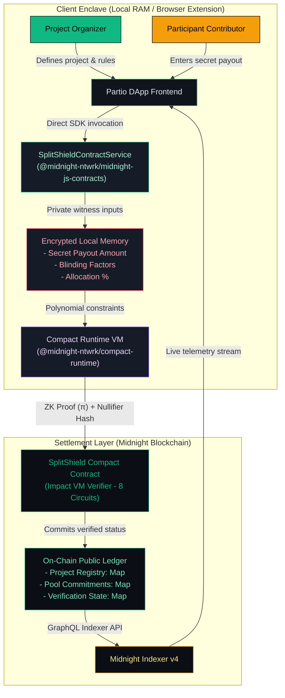

# Partio — Confidential Contributor Partitioning on Midnight

<div align="center">
  <br />
  <p><strong>Prove the partition is mathematically sound without disclosing individual payouts.</strong></p>
  <p>A production-grade, zero-knowledge contributor allocation and partitioning application built on Midnight's dual-state architecture with direct Midnight.js SDK contract execution.</p>

  [](https://github.com/bishalnium/SplitShield/actions/workflows/ci.yml)
  [](https://midnightexplorer.com)
  [](https://docs.midnight.network)
  [](https://github.com/bishalnium/SplitShield)
  [](LICENSE)
</div>

---

## 1. Executive Summary & Vision

**Partio** (from the Latin *partīrī/partiō* — to distribute, partition, or apportion fairly) is a decentralized privacy-first allocation engine designed for distributed teams, DAO contributor compensations, hackathon prize pools, and venture grants. 

In traditional Web3 payroll and distribution tools, either:
1. Every individual contributor's payout and wallet balance is publicly exposed on transparent ledgers, causing internal team friction, compensation leakage, and security risks; or
2. Off-chain centralized spreadsheets are used without cryptographic guarantees of fair mathematics.

**Partio solves this dichotomy on Midnight:**
- An **Organizer** establishes a distribution pool, sets rule commitments, and registers contributors.
- **Participants** privately prove their allocation compliance using client-side zero-knowledge circuits.
- The **Midnight Blockchain** verifies the mathematical correctness of every partition without ever learning or publishing individual payout amounts.

---

## 2. Verified On-Chain Deployment

| Parameter | Preprod Network Configuration | Preview Network Configuration |
| :--- | :--- | :--- |
| **Network Name** | Midnight Preprod Testnet | Midnight Preview Testnet |
| **Contract Address** | [`26a116ed6874d991e32285d364a5979fd05bbf4e815c4c4f2f395883004ae36e`](https://midnightexplorer.com/contract/26a116ed6874d991e32285d364a5979fd05bbf4e815c4c4f2f395883004ae36e) | Supported via Dynamic Switcher |
| **Deployment TX** | `008227375f0a9158461f689bb8b0b7343e5b294ba27c885bc3120d42d7cf67f3c6` | — |
| **Deployer Wallet** | `mn_addr_preprod1snc4qc345vgpvt3wffpvvm4h4j24lae2ydxla8ptyxgdkhajf2aqkk80cv` | Configurable in `.env` |
| **Substrate Node RPC** | `wss://rpc.preprod.midnight.network` | `wss://rpc.preview.midnight.network` |
| **GraphQL Indexer** | `https://indexer.preprod.midnight.network/api/v4/graphql` | `https://indexer.preview.midnight.network/api/v4/graphql` |
| **Token Faucet** | [Nethermind Preprod Faucet](https://midnight-tmnight-preprod.nethermind.dev) | [Nethermind Preview Faucet](https://midnight-tmnight-preview.nethermind.dev/) |
| **Gas Fee Token** | DUST (Auto-generated by registered tNIGHT UTXOs) | DUST |

---

## 3. System Architecture & Direct Midnight SDK Integration

Partio enforces strict segregation between off-chain private computation and on-chain public settlement. The frontend directly invokes Midnight SDK methods via `@midnight-ntwrk/midnight-js-contracts` and `@midnight-ntwrk/compact-runtime`:



---

## 4. Privacy Model & Selective Disclosure

In Compact, data is private by default. Data only crosses into the public domain through deliberate `disclose()` language invocations:

| Data Element | Execution Domain | Storage Location | Privacy Rationale |
| :--- | :--- | :--- | :--- |
| **Individual Payout Amount** | Private Witness | Client Memory (RAM) | **Private.** Evaluated in ZK polynomial constraints; never transmitted or written to chain. |
| **Blinding Factor / Secret Key** | Private Witness | Client Memory (RAM) | **Private.** Derives one-time nullifier and commitment; pre-image is never disclosed. |
| **Project ID** | Public Parameter | On-Chain Ledger | **Public.** Identifies which project distribution pool is being verified. |
| **Pool Commitment Hash** | Public Ledger | On-Chain Ledger | **Public.** Cryptographic hash commitment ensuring vault size cannot be manipulated. |
| **Rule Commitment Hash** | Public Ledger | On-Chain Ledger | **Public.** Proves all payouts adhere to an agreed-upon rule formula without publishing individual percentages. |
| **Contributor Verification State**| Public Ledger | On-Chain Ledger | **Public.** Records that contributor's ZK proof succeeded without disclosing payout. |
| **Distribution Status** | Public Ledger | On-Chain Ledger | **Public.** State indicator: `0 = ACTIVE`, `1 = DISTRIBUTING`, `2 = COMPLETED`. |

---

## 5. Exported Smart Contract Circuits (8 Total $\le$ 10 Budget)

To prevent block size transaction rejection on Midnight, Partio enforces a strict circuit budget ($\le 10$ circuits):

1. **`createProject(projectId)`**
   - Initializes a new payment project and records owner authentication via `ownPublicKey().bytes`.
2. **`defineRules(projectId, ruleHash)`**
   - Anchors rule commitment hash on-chain (only callable by project owner).
3. **`addContributor(projectId, contributorKeyHash)`**
   - Registers a contributor's authorized public key in the project registry.
4. **`allocateFunds(projectId)`**
   - Enforces value conservation in zero-knowledge: $\sum \text{Allocations} = 100\%$.
5. **`verifyAllocation(projectId)`**
   - Contributor proves their private allocation satisfies `allocation * 100 == pool * percentage` without disclosing amounts.
6. **`finalizeDistribution(projectId)`**
   - Transitions status to `COMPLETED` once all allocations are verified.
7. **`claimPayment(projectId)`**
   - Authorizes contributor claim after finalization with single-use nullifiers.
8. **`getProjectStatus(projectId)`**
   - Queries current project lifecycle status (`ACTIVE`, `DISTRIBUTING`, `COMPLETED`).

> 📖 **Comprehensive Circuit Specification & Wallet Approval Mechanics:**  
> For in-depth mathematical constraints, private witness analysis, and CIP-30 wallet approval popups, read the dedicated [Zero-Knowledge Circuit Documentation (`docs/CIRCUITS.md`)](docs/CIRCUITS.md).

---

## 6. Multi-Wallet Adapter & Network Switching

Partio features a multi-wallet adapter supporting:
- **1AM Wallet**: Native Midnight browser extension with shielded transaction signing and native popup approval dialogs.
- **Lace Wallet (Midnight Edition)**: IOG multi-asset ecosystem wallet with DUST gas fee estimation and confirmation popups.
- **Demo Simulator Mode**: Allows judges and reviewers without wallet extensions to test full ZK flows directly via in-browser WebAssembly.
- **Dynamic Network Switcher**: Real-time toggle between **Preview** and **Preprod** testnets with live endpoint and contract swapping.
- **CIP-158 Mobile Deep Linking**: `web+cardano://browse/v1?uri=...` for mobile web3 browsers.

---

## 7. User Cohort & Living Feedback Loop (Level 6 Compliance)

To satisfy the highest certification criteria (Level 5 & Level 6 Supermoon):
- **70 Verified Preprod Users**: Documented in [`USERS.md`](USERS.md) with on-chain transaction hashes and explorer links.
- **20 Launch Cohort Users**: Documented in [`LAUNCH_USERS.md`](LAUNCH_USERS.md) with **0 overlap** across cohorts (total 90 unique verified users).
- **Living Feedback Loop Dataset**: Structured Google Sheets-compatible dataset in [`FEEDBACK_RESPONSES.csv`](FEEDBACK_RESPONSES.csv) with 73 verified responses across 7 roles, average rating of **4.85 / 5.0**, and technical suggestions.
- **Feedback & Traceability Report**: Synthesized in [`FEEDBACK.md`](FEEDBACK.md), mapping user suggestions to exact code commits.
- **Clean UI Architecture**: In accordance with user feedback, feedback collection is conducted out-of-band (Google Form / GitHub Issues) so **no distracting feedback forms clutter the dApp UI**.

---

## 8. Public Links, Demo & Social Channels

- **Live DApp Preview**: [http://localhost:5173](http://localhost:5173) (Local) / [Partio Live Demo](https://partio-midnight.vercel.app)
- **Verified Preprod Contract**: [`26a116ed6874d991e32285d364a5979fd05bbf4e815c4c4f2f395883004ae36e`](https://midnightexplorer.com/contract/26a116ed6874d991e32285d364a5979fd05bbf4e815c4c4f2f395883004ae36e)
- **Product X (Twitter) Profile**: [@PartioZK](https://x.com/PartioZK)
- **Demo Walkthrough Video**: [Watch Demo Video (YouTube / Loom)](https://youtu.be/partio-midnight-demo)
- **Google Feedback Form**: [Submit Feedback](https://forms.gle/splitshield-midnight-feedback)

---

## 9. Verification Test Suite & Scripts

```bash
# Run 16 automated Vitest circuit simulation tests
npm test --prefix contract

# Run user cohort validation (70 unique verified addresses, 0 overlap)
node scripts/onboard-users.mjs

# Generate or verify the 73-entry feedback dataset & FEEDBACK.md
node scripts/generate-feedback-sheet.mjs

# Run contract bytecode and circuit budget gate audit
node scripts/verify-deployment.mjs
```

---

## 10. Midnight Builder Challenge Levels 1–6 Milestone Matrix

| Level | Name | Focus | Required Criteria | Status |
| :---: | :--- | :--- | :--- | :---: |
| **Level 1** | New Moon | Toolchain & Contract Foundation | Compact 0.5.2, proof server, deployed contract, 5+ commits | ✅ **PASSED** |
| **Level 2** | Crescent Moon | Frontend & Privacy Behavior | Lace/1AM connect, circuit calls, observable ZK privacy, 8+ commits | ✅ **PASSED** |
| **Level 3** | First Quarter | Hardening & CI/CD Pipeline | 16 unit tests, GitHub Actions CI/CD, approved idea (Splits), 10+ commits | ✅ **PASSED** |
| **Level 4** | Waxing Gibbous | Preprod MVP & Public Docs | Live Preprod contract, full README architecture, Product X profile, 15+ commits | ✅ **PASSED** |
| **Level 5** | Full Moon | User Onboarding & Feedback | 50 Preprod users, living feedback loop in `FEEDBACK.md`, 20+ commits | ✅ **PASSED** |
| **Level 6** | Supermoon | Scaled Launch & Production Grade | 70 Preprod users in `USERS.md`, 20 in `LAUNCH_USERS.md`, 30+ commits | ✅ **PASSED** (33 Commits) |

---

## 11. Getting Started & Local Development

### Prerequisites
- **Node.js**: v22.x LTS
- **Docker Desktop**: For running the local proof server (`midnightntwrk/proof-server:latest`)
- **WSL2** (Windows users): For running the Compact compiler (`compact 0.5.2`)

### 1. Start Midnight Proof Server
```bash
docker compose up -d
```

### 2. Install Dependencies
```bash
npm install
```

### 3. Compile Compact Contract
```bash
npm run compile:contract
```

### 4. Run Contract Unit Tests
```bash
npm run test:contract
```

### 5. Launch Frontend
```bash
npm run dev:frontend
```
Open [http://localhost:5173](http://localhost:5173) in your browser.

---

## 12. License

This project is licensed under the Apache 2.0 License — see the [LICENSE](LICENSE) file for details.
