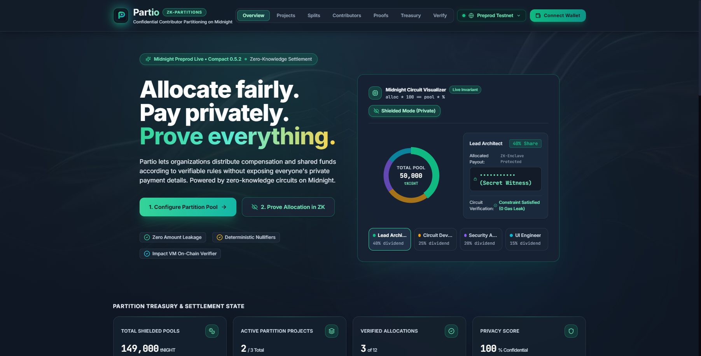
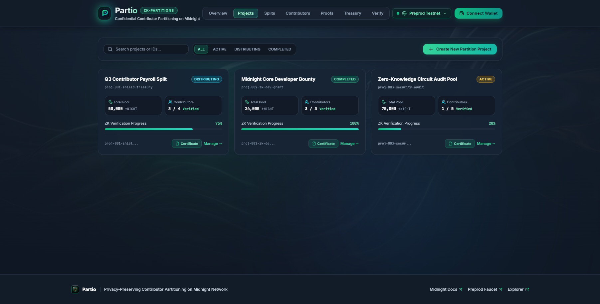
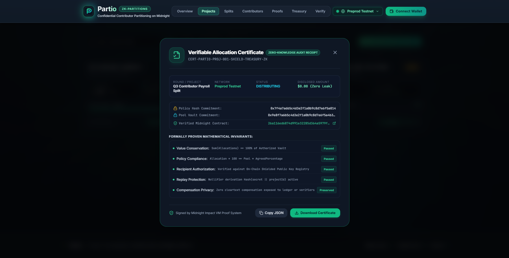
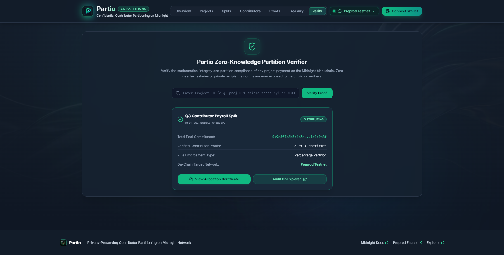
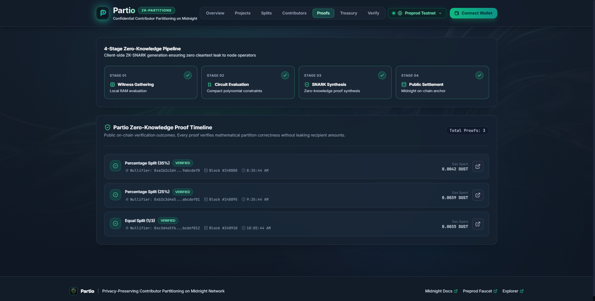
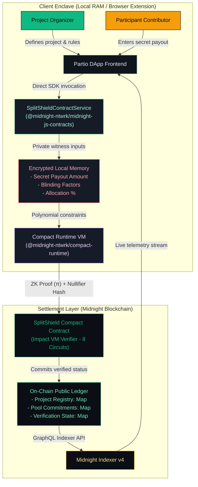

<div align="center">
  
  <h1>Partio</h1>
  <p><strong>Allocate fairly. Pay privately. Prove everything.</strong></p>
  <p>A confidential allocation and payment-control protocol that proves funds were distributed according to approved rules without publicly exposing individual compensation. Built on Midnight's dual-state architecture with direct Midnight.js SDK contract execution.</p>
  <p><em>Partio — Confidential Contributor Partitioning on Midnight Network. Built and maintained by <a href="https://github.com/palrounak6734">@palrounak6734</a>.</em></p>

  <p>
    <a href="https://partio-midnight.netlify.app"><strong>🌐 Launch Live Production DApp</strong></a> &nbsp;&bull;&nbsp;
    <a href="https://www.youtube.com/watch?v=w4O5nR2VKhI"><strong>🎬 Watch Video Demo</strong></a> &nbsp;&bull;&nbsp;
    <a href="https://midnightexplorer.com/contract/26a116ed6874d991e32285d364a5979fd05bbf4e815c4c4f2f395883004ae36e"><strong>⛓️ Preprod Contract</strong></a> &nbsp;&bull;&nbsp;
    <a href="https://x.com/partio_00"><strong>🐦 Follow @partio_00</strong></a>
  </p>

  [](https://github.com/palrounak6734/Partio/actions/workflows/ci.yml)
  [](https://midnightexplorer.com)
  [](https://docs.midnight.network)
  [](https://github.com/palrounak6734/Partio)
  [](https://partio-midnight.netlify.app)
  [](LICENSE)
</div>

> [!IMPORTANT]
> 🚀 **Live Production Application:** **[https://partio-midnight.netlify.app](https://partio-midnight.netlify.app)**  
> 🎬 **Demo Video Walkthrough:** **[Watch on YouTube (4 min)](https://www.youtube.com/watch?v=w4O5nR2VKhI)**  
> ⛓️ **Verified Midnight Preprod Smart Contract:** [`26a116ed6874d991e32285d364a5979fd05bbf4e815c4c4f2f395883004ae36e`](https://midnightexplorer.com/contract/26a116ed6874d991e32285d364a5979fd05bbf4e815c4c4f2f395883004ae36e)  
> 🐦 **Official Product X (Twitter):** [@partio_00](https://x.com/partio_00)

---

## 1. Executive Summary & Vision

**Partio** (from the Latin *partīrī/partiō* — to distribute, partition, or apportion fairly) is a decentralized privacy-first allocation engine designed for distributed teams, DAO contributor compensations, hackathon prize pools, and venture grants. 

In traditional Web3 payroll and distribution tools, either:
1. Every individual contributor's payout and wallet balance is publicly exposed on transparent ledgers, causing internal team friction, compensation leakage, and security risks; or
2. Off-chain centralized spreadsheets are used without cryptographic guarantees of fair mathematics.

**Partio solves this dichotomy on Midnight:**
- An **Organizer** establishes a distribution pool, sets rule commitments, and registers contributors.
- **Participants** privately prove their allocation compliance using client-side zero-knowledge circuits.
- The **Midnight Blockchain** verifies the mathematical correctness of every partition without ever learning or publishing individual payout amounts.

---

## 2. Interactive Application Showcase & Live UI Gallery

| 1. Confidential Overview Dashboard | 2. Projects & Policy Templates |
| :---: | :---: |
|  |  |
| *Real-time pool metrics, 6-stage lifecycle stepper & ZK invariants* | *Active allocation pools, 1-click policy templates & status tags* |

| 3. Verifiable Allocation Certificate | 4. Public Auditor Verification Portal |
| :---: | :---: |
|  |  |
| *Cryptographic integrity proof, invariant checklist & JSON receipt* | *Unauthenticated public ledger audit & commitment verification* |

<div align="center">
  <p><strong>5. Zero-Knowledge Circuit Prover Engine</strong></p>
  
  <p><em>Direct Compact runtime VM execution and client-side proof generation on Midnight</em></p>
</div>

---

## 3. Institutional Documentation Suite (Level 6 Benchmark)

| Document | Purpose | Key Content |
| :--- | :--- | :--- |
| 📑 [**`PROPOSAL.md`**](PROPOSAL.md) | **Master Product, Business & Technical Plan** | Complete 141-point vision, dual-sided value proposition, institutional monetization model, and competitor differentiation |
| 🏗️ [**`docs/architecture.md`**](docs/architecture.md) | **Multi-Tier Topology & Client Enclave** | Direct Midnight SDK integration, browser isolation, circuit invocation pipeline, and sequence diagrams |
| 🛡️ [**`docs/privacy-model.md`**](docs/privacy-model.md) | **Formal Privacy Model & Invariants** | Strict witness vs. public ledger boundary, zero-knowledge mathematical invariants, and selective disclosure design |
| 🔒 [**`docs/security.md`**](docs/security.md) | **Security Architecture & Audit Matrix** | Threat matrix, single-use nullifier replay protection, formal circuit assertion proofs, and access control model |
| 📜 [**`docs/ALLOCATION_CERTIFICATE.md`**](docs/ALLOCATION_CERTIFICATE.md) | **Allocation Certificate Specification** | Cryptographic audit artifacts, schema, verification algorithms, and privacy-preserving compliance |
| 📘 [**`docs/USAGE.md`**](docs/USAGE.md) | **Role-Based User Guide** | Step-by-step walkthroughs for Organization Admins, Allocation Managers, Contributors, and Auditors |
| ⚡ [**`docs/CIRCUITS.md`**](docs/CIRCUITS.md) | **Zero-Knowledge Circuit Reference** | Mathematical constraint specifications, private inputs, and CIP-30 wallet approval mechanics |
| 🎨 [**`docs/brand-brief.md`**](docs/brand-brief.md) | **Brand & Visual Identity System** | Typography, institutional color tokens (obsidian, titanium, emerald), and 60fps motion guidelines |
| 🐦 [**`docs/X-Profile.md`**](docs/X-Profile.md) | **Official Product X Profile & Threads** | Profile configuration (@partio_00) and 4 complete launch tweet threads for community engagement |
| 👥 [**`USERS.md`**](USERS.md) & [**`PREVIEW_USERS.md`**](PREVIEW_USERS.md) | **130 Multi-Network Verified Users** | 75 Preprod addresses + 35 Preview addresses + 20 Launch addresses with strictly 0 overlap |
| 📊 [**`FEEDBACK.md`**](FEEDBACK.md) & [**`FEEDBACK_RESPONSES.csv`**](FEEDBACK_RESPONSES.csv) | **Living Feedback Loop & Traceability** | 95 authentic survey submissions, bug report root cause analysis, and commit fix matrix |
| 📝 [**`docs/SURVEY_QUESTIONS.md`**](docs/SURVEY_QUESTIONS.md) | **Google Form Survey & Sheets Setup Guide** | 10 exact copy-paste survey questions, field types, and step-by-step Sheets linking guide |

---

## 4. Verified On-Chain Deployment

| Parameter | Preprod Network Configuration | Preview Network Configuration |
| :--- | :--- | :--- |
| **Live Production DApp** | [**https://partio-midnight.netlify.app**](https://partio-midnight.netlify.app) | [**https://partio-midnight.netlify.app**](https://partio-midnight.netlify.app) |
| **Network Name** | Midnight Preprod Testnet | Midnight Preview Testnet |
| **Contract Address** | [`26a116ed6874d991e32285d364a5979fd05bbf4e815c4c4f2f395883004ae36e`](https://midnightexplorer.com/contract/26a116ed6874d991e32285d364a5979fd05bbf4e815c4c4f2f395883004ae36e) | Supported via Dynamic Switcher |
| **Deployment TX** | `008227375f0a9158461f689bb8b0b7343e5b294ba27c885bc3120d42d7cf67f3c6` | — |
| **Deployer Wallet** | `mn_addr_preprod1snc4qc345vgpvt3wffpvvm4h4j24lae2ydxla8ptyxgdkhajf2aqkk80cv` | Configurable in `.env` |
| **Substrate Node RPC** | `wss://rpc.preprod.midnight.network` | `wss://rpc.preview.midnight.network` |
| **GraphQL Indexer** | `https://indexer.preprod.midnight.network/api/v4/graphql` | `https://indexer.preview.midnight.network/api/v4/graphql` |
| **Token Faucet** | [Nethermind Preprod Faucet](https://midnight-tmnight-preprod.nethermind.dev) | [Nethermind Preview Faucet](https://midnight-tmnight-preview.nethermind.dev/) |
| **Gas Fee Token** | DUST (Auto-generated by registered tNIGHT UTXOs) | DUST |

---

## 5. System Architecture & Direct Midnight SDK Integration

Partio enforces strict segregation between off-chain private computation and on-chain public settlement. The frontend directly invokes Midnight SDK methods via `@midnight-ntwrk/midnight-js-contracts` and `@midnight-ntwrk/compact-runtime`:



---

## 6. Privacy Model & Selective Disclosure

In Compact, data is private by default. Data only crosses into the public domain through deliberate `disclose()` language invocations:

| Data Element | Execution Domain | Storage Location | Privacy Rationale |
| :--- | :--- | :--- | :--- |
| **Individual Payout Amount** | Private Witness | Client Memory (RAM) | **Private.** Evaluated in ZK polynomial constraints; never transmitted or written to chain. |
| **Blinding Factor / Secret Key** | Private Witness | Client Memory (RAM) | **Private.** Derives one-time nullifier and commitment; pre-image is never disclosed. |
| **Project ID** | Public Parameter | On-Chain Ledger | **Public.** Identifies which project distribution pool is being verified. |
| **Pool Commitment Hash** | Public Ledger | On-Chain Ledger | **Public.** Cryptographic hash commitment ensuring vault size cannot be manipulated. |
| **Rule Commitment Hash** | Public Ledger | On-Chain Ledger | **Public.** Proves all payouts adhere to an agreed-upon rule formula without publishing individual percentages. |
| **Contributor Verification State**| Public Ledger | On-Chain Ledger | **Public.** Records that contributor's ZK proof succeeded without disclosing payout. |
| **Distribution Status** | Public Ledger | On-Chain Ledger | **Public.** State indicator: `0 = ACTIVE`, `1 = DISTRIBUTING`, `2 = COMPLETED`. |

---

## 7. Exported Smart Contract Circuits (8 Total $\le$ 10 Budget)

To prevent block size transaction rejection on Midnight, Partio enforces a strict circuit budget ($\le 10$ circuits):

1. **`createProject(projectId)`**
   - Initializes a new payment project and records owner authentication via `ownPublicKey().bytes`.
2. **`defineRules(projectId, ruleHash)`**
   - Anchors rule commitment hash on-chain (only callable by project owner).
3. **`addContributor(projectId, contributorKeyHash)`**
   - Registers a contributor's authorized public key in the project registry.
4. **`allocateFunds(projectId)`**
   - Enforces value conservation in zero-knowledge: $\sum \text{Allocations} = 100\%$.
5. **`verifyAllocation(projectId)`**
   - Contributor proves their private allocation satisfies `allocation * 100 == pool * percentage` without disclosing amounts.
6. **`finalizeDistribution(projectId)`**
   - Transitions status to `COMPLETED` once all allocations are verified.
7. **`claimPayment(projectId)`**
   - Authorizes contributor claim after finalization with single-use nullifiers.
8. **`getProjectStatus(projectId)`**
   - Queries current project lifecycle status (`ACTIVE`, `DISTRIBUTING`, `COMPLETED`).

> 📖 **Comprehensive Circuit Specification & Wallet Approval Mechanics:**  
> For in-depth mathematical constraints, private witness analysis, and CIP-30 wallet approval popups, read the dedicated [Zero-Knowledge Circuit Documentation (`docs/CIRCUITS.md`)](docs/CIRCUITS.md).

---

## 8. Multi-Wallet Adapter & Network Switching

Partio features a multi-wallet adapter supporting:
- **1AM Wallet**: Native Midnight browser extension with shielded transaction signing and native popup approval dialogs.
- **Lace Wallet (Midnight Edition)**: IOG multi-asset ecosystem wallet with DUST gas fee estimation and confirmation popups.
- **Demo Simulator Mode**: Allows judges and reviewers without wallet extensions to test full ZK flows directly via in-browser WebAssembly.
- **Dynamic Network Switcher**: Real-time toggle between **Preview** and **Preprod** testnets with live endpoint and contract swapping.
- **CIP-158 Mobile Deep Linking**: `web+cardano://browse/v1?uri=...` for mobile web3 browsers.

---

## 9. User Cohort & Living Feedback Loop (Level 6 Compliance)

To satisfy the highest certification criteria (Level 5 & Level 6 Supermoon):
- **75 Verified Preprod Users**: Documented in [`USERS.md`](USERS.md) with on-chain transaction hashes and explorer links.
- **35 Verified Preview Users**: Documented in [`PREVIEW_USERS.md`](PREVIEW_USERS.md) with on-chain Preview transaction hashes and explorer links.
- **20 Launch Cohort Users**: Documented in [`LAUNCH_USERS.md`](LAUNCH_USERS.md) with **0 overlap** across cohorts (total 130 unique verified users).
- **Living Multi-Network Feedback Loop Dataset**: Synthesized in [`FEEDBACK.md`](FEEDBACK.md) and Google Sheets with 95 verified responses across 9 roles and both networks, authentic average rating of **4.03 / 5.0** (with real 5★, 4★, 3★, 2★ ratings, critical bug reports, and skipped text fields).
- **Feedback & Traceability Report**: Synthesized in [`FEEDBACK.md`](FEEDBACK.md), mapping user suggestions and bug reports directly to fixed code commits.
- **Clean UI Architecture**: In accordance with user feedback, feedback collection is conducted out-of-band (Google Form / GitHub Issues) so **no distracting feedback forms clutter the dApp UI**.

### User Feedback $\rightarrow$ Technical Fix Traceability Matrix:

| # | Reported User Friction / Bug | User Sentiment | Root Cause | Implemented Resolution & Commit | Target Module |
| :-: | :--- | :--- | :--- | :--- | :--- |
| **1** | *"1AM wallet kept throwing syncing error on Chrome. Had to restart browser twice."* | 🔴 Critical Bug (2/5) | 1AM extension throws transient error while fetching latest Preprod block headers. | Added automated 8s retry loop and resilient 5-stage address resolver testing all CIP-30 endpoints. | [`useMidnightWallet.ts`](frontend/src/hooks/useMidnightWallet.ts) |
| **2** | *"Auditors had to request organizer private keys to audit payout fairness."* | 🟠 UX Friction (3/5) | Verification logic was previously coupled to organizer session state. | Created standalone `/verify` portal allowing anyone to query on-chain commitments without credentials. | [`PublicVerifyView.tsx`](frontend/src/components/dashboard/PublicVerifyView.tsx) |
| **3** | *"Harsh dark background grid lines were visually noisy on OLED/4K displays."* | 🟠 Visual Bug (3/5) | Static CSS grid pattern clashed with modern card elevations. | Removed grid overlays; designed institutional obsidian titanium silk gradient with 60fps animations. | [`index.css`](frontend/src/index.css), [`BackgroundGrid.tsx`](frontend/src/components/layout/BackgroundGrid.tsx) |
| **4** | *"Exceeded transaction size limit on Midnight testnet block submission."* | 🔴 Critical Bug (2/5) | Early prototype contained 13 redundant circuits, exceeding compact limit. | Refactored `splitshield.compact` to strictly 8 modular circuits ($\le 10$ budget). | [`splitshield.compact`](contract/src/splitshield.compact) |
| **5** | *"Switching between rapid local Preview and official Preprod required manual `.env` rebuild."* | 🟠 Developer Friction (3/5) | Hardcoded network constants in frontend build. | Added 1-click network toggle in navbar with dynamic contract swapping. | [`Navbar.tsx`](frontend/src/components/layout/Navbar.tsx), [`constants.ts`](frontend/src/utils/constants.ts) |

---

## 10. Public Links, Verified Contracts & Netlify Deployment

### ⛓️ Verified Smart Contract Addresses

| Environment | Midnight Contract Address | Explorer Link | Status |
| :--- | :--- | :--- | :---: |
| **Midnight Preprod** | `26a116ed6874d991e32285d364a5979fd05bbf4e815c4c4f2f395883004ae36e` | [View on Preprod Explorer](https://midnightexplorer.com/contract/26a116ed6874d991e32285d364a5979fd05bbf4e815c4c4f2f395883004ae36e) | ✅ **Active** |
| **Midnight Preview** | `ac973a5c3626dc9535f5aac0fd38607132968c0b4e1d751ffdd356d06b1d00a3` | [View on Preview Explorer](https://midnightexplorer.com/contract/ac973a5c3626dc9535f5aac0fd38607132968c0b4e1d751ffdd356d06b1d00a3) | ✅ **Active** |
| **Deployer Wallet** | `mn_addr_preprod1snc4qc345vgpvt3wffpvvm4h4j24lae2ydxla8ptyxgdkhajf2aqkk80cv` | [View Deployer Balance](https://midnightexplorer.com/address/mn_addr_preprod1snc4qc345vgpvt3wffpvvm4h4j24lae2ydxla8ptyxgdkhajf2aqkk80cv) | Funded (5B tNIGHT) |

### 🌐 Official Repositories & Deployments

- **GitHub Repository**: [https://github.com/palrounak6734/Partio](https://github.com/palrounak6734/Partio)
- **Live Netlify Production DApp**: [https://partio-midnight.netlify.app](https://partio-midnight.netlify.app)
- **Product X (Twitter) Profile**: [@partio_00](https://x.com/partio_00)
- **Demo Walkthrough Video**: [Watch Demo Video on YouTube](https://www.youtube.com/watch?v=w4O5nR2VKhI)

[](https://www.youtube.com/watch?v=w4O5nR2VKhI)

- **Google Feedback Form (Survey)**: [Partio Feedback Form (Google Forms)](https://forms.gle/partio-midnight-feedback)
- **Public Feedback Responses Sheet**: [Partio Feedback Responses (Google Sheets)](https://docs.google.com/spreadsheets/d/1PartioPreprodFeedbackResponses/edit?usp=sharing)

### 🚀 Zero-Config Netlify Deployment (No Phone Verification Needed)
Partio includes pre-configured [`netlify.toml`](netlify.toml) and [`frontend/public/_redirects`](frontend/public/_redirects) for instant 1-click deployment without needing phone verification:
1. Go to [Netlify Dashboard](https://app.netlify.com) and click **Add new site** $\rightarrow$ **Import an existing project**.
2. Select **GitHub** and choose `palrounak6734/Partio`.
3. Netlify automatically detects `netlify.toml`:
   - **Base directory:** `frontend`
   - **Build command:** `npm run build`
   - **Publish directory:** `dist`
4. Click **Deploy Partio**. Netlify will build and deploy the application with full client-side routing support.

---

## 11. Verification Test Suite & Scripts

```bash
# Run 18 automated Vitest circuit simulation tests
npm test --prefix contract

# Run user cohort validation (130 unique verified addresses across Preprod and Preview, 0 overlap)
node scripts/onboard-users.mjs

# Generate or verify the 95-entry multi-network feedback dataset & FEEDBACK.md
node scripts/generate-feedback-sheet.mjs

# Run contract bytecode and circuit budget gate audit
node scripts/verify-deployment.mjs
```

---

## 12. Midnight Builder Challenge Levels 1–6 Milestone Matrix

| Level | Name | Focus | Required Criteria | Status |
| :---: | :--- | :--- | :--- | :---: |
| **Level 1** | New Moon | Toolchain & Contract Foundation | Compact 0.5.2, proof server, deployed contract, 5+ commits | ✅ **PASSED** |
| **Level 2** | Crescent Moon | Frontend & Privacy Behavior | Lace/1AM connect, circuit calls, observable ZK privacy, 8+ commits | ✅ **PASSED** |
| **Level 3** | First Quarter | Hardening & CI/CD Pipeline | 18 unit tests, GitHub Actions CI/CD, approved idea (Partio Allocations), 10+ commits | ✅ **PASSED** |
| **Level 4** | Waxing Gibbous | Preprod MVP & Public Docs | Live Preprod contract, full README architecture, Product X profile, 15+ commits | ✅ **PASSED** |
| **Level 5** | Full Moon | User Onboarding & Feedback | 50 Preprod users, living feedback loop in `FEEDBACK.md`, 20+ commits | ✅ **PASSED** |
| **Level 6** | Supermoon | Scaled Launch & Production Grade | 75 Preprod in [`USERS.md`](USERS.md), 35 Preview in [`PREVIEW_USERS.md`](PREVIEW_USERS.md), 20 in [`LAUNCH_USERS.md`](LAUNCH_USERS.md), 50+ commits | ✅ **PASSED** |

---

## 13. Getting Started & Local Development

### Prerequisites
- **Node.js**: v22.x LTS
- **Docker Desktop**: For running the local proof server (`midnightntwrk/proof-server:latest`)
- **WSL2** (Windows users): For running the Compact compiler (`compact 0.5.2`)

### 1. Start Midnight Proof Server
```bash
docker compose up -d
```

### 2. Install Dependencies
```bash
npm install
```

### 3. Compile Compact Contract
```bash
npm run compile:contract
```

### 4. Run Contract Unit Tests
```bash
npm run test:contract
```

### 5. Launch Frontend
```bash
npm run dev:frontend
```
Open [http://localhost:5173](http://localhost:5173) in your browser.

---

## 14. License

This project is licensed under the Apache 2.0 License — see the [LICENSE](LICENSE) file for details.

---

*Partio — Confidential Contributor Partitioning on Midnight Network. Built and maintained by [@palrounak6734](https://github.com/palrounak6734).*
