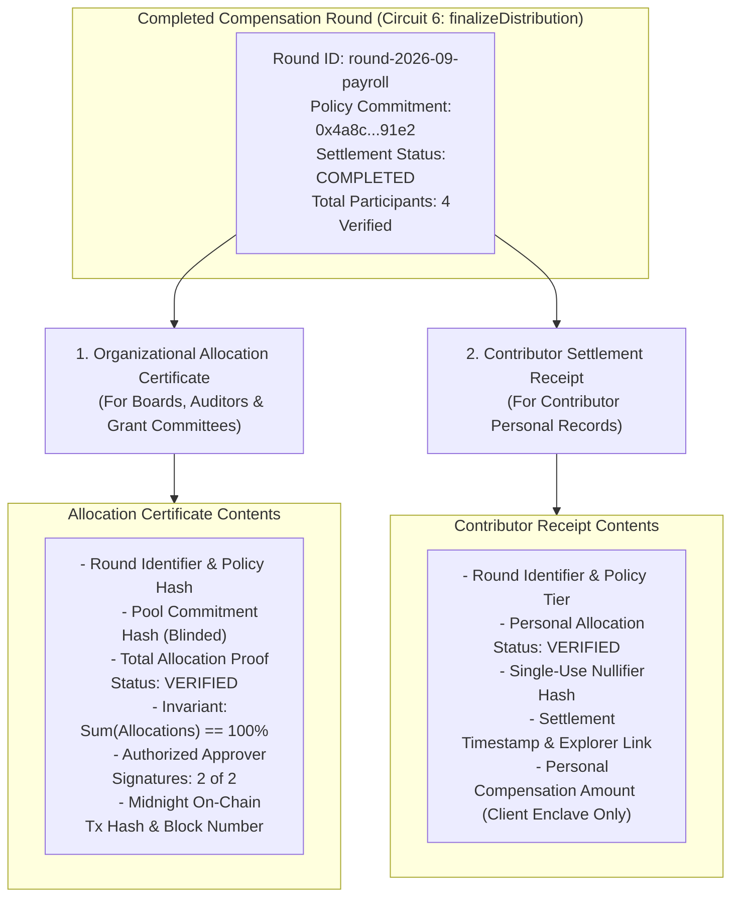

# Partio — Allocation Certificate & Settlement Verification Specification

> **Document Version:** 1.0.0  
> **Signature Feature:** Cryptographic Auditability Without Salary Disclosure  
> **Platform Version:** Partio v0.1.0 (Midnight Preprod & Preview)

---

## 1. Executive Summary

In traditional Web3 payroll, organizations face an impossible choice:
1. **Publish full payment records on-chain**, exposing every contributor’s salary, rate, and bonus to the world; or
2. **Conduct payroll off-chain via private bank wires/spreadsheets**, losing all cryptographic proof of governance compliance.

Partio resolves this dilemma through its signature innovation: the **Allocation Certificate**.

An Allocation Certificate is an exportable, tamper-evident cryptographic artifact that proves:
- An organizational compensation policy was authorized by designated signers
- The treasury pool was fully funded
- All recipient public key hashes were authorized in the project registry
- Distribution rules satisfied value conservation ($\sum P_i = 100\%$)
- Every settled payout corresponded to an approved policy tier
- **All achieved without disclosing individual salaries, bonus amounts, or negotiated rates!**

---

## 2. Certificate Architecture & Dual-Receipt Model

Partio issues two distinct, mathematically coupled receipts at the conclusion of every compensation round:



---

## 3. Sample Allocation Certificate (Auditor View)

```json
{
  "protocol": "Partio",
  "version": "1.0.0",
  "certificateType": "ORGANIZATIONAL_ALLOCATION_CERTIFICATE",
  "network": "midnight-preprod",
  "contractAddress": "26a116ed6874d991e32285d364a5979fd05bbf4e815c4c4f2f395883004ae36e",
  "round": {
    "id": "proj-001-shield-treasury",
    "title": "Q3 Contributor Payroll Split",
    "policyVersion": "P-014",
    "policyCommitmentHash": "0x9e8f7a6b5c4d3e2f1a0b9c8d7e6f5a4b3c2d1e0f9a8b7c6d5e4f3a2b1c0d9e8f",
    "poolCommitmentHash": "0x4a5b6c7d8e9f0a1b2c3d4e5f6a7b8c9d0e1f2a3b4c5d6e7f8a9b0c1d2e3f4a5b",
    "ruleType": "PERCENTAGE_PARTITION",
    "status": "COMPLETED",
    "statusCode": 2
  },
  "cryptographicProof": {
    "proofSystem": "Midnight-Compact-Plonk-ZK-SNARK",
    "valueConservationInvariant": "SATISFIED (Sum = 100%, Delta = 0)",
    "proportionalityInvariant": "SATISFIED (alloc * 100 == pool * %)",
    "totalAllocationsVerified": 4,
    "totalParticipants": 4,
    "circuitBudget": "8 / 10 circuits",
    "verificationTimestamp": 1790278400000,
    "onChainTxHash": "008227375f0a9158461f689bb8b0b7343e5b294ba27c885bc3120d42d7cf67f3c6",
    "midnightExplorerUrl": "https://midnightexplorer.com/contract/26a116ed6874d991e32285d364a5979fd05bbf4e815c4c4f2f395883004ae36e"
  },
  "complianceAttestation": {
    "compensationPrivacyGuaranteed": true,
    "zeroCleartextSalariesExposed": true,
    "reproducibleViaWasmProver": true
  }
}
```

---

## 4. Verification Workflow for External Regulators & Tax Authorities

1. **Independent Retrieval:** Regulators take the `roundId` and query the Midnight ledger via the `/verify` portal or raw Substrate RPC.
2. **Cryptographic Validation:** The auditor inspects the on-chain `poolCommitments` and `allocationVerified` mappings.
3. **No Private Key Requirement:** The auditor verifies mathematical truth directly from the state hashes without needing access to any employee's private keys or sensitive rate cards.
