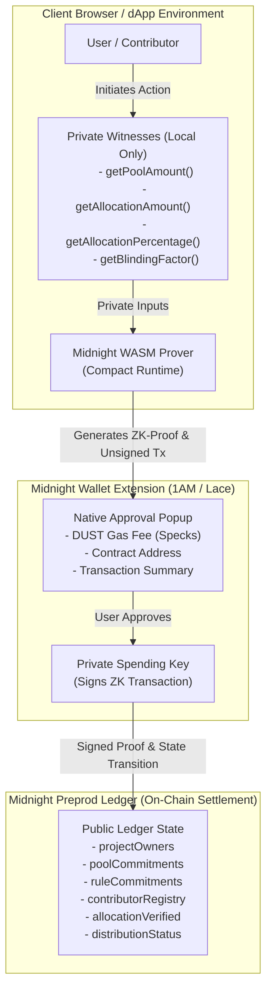
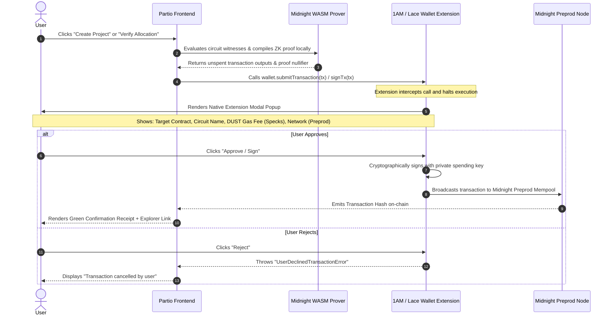

# Partio — Zero-Knowledge Circuit Specification & Architecture

> **Document Version:** 1.0.0  
> **Target Network:** Midnight Preprod Testnet (`preprod`)  
> **Deployed Contract Address:** `26a116ed6874d991e32285d364a5979fd05bbf4e815c4c4f2f395883004ae36e`  
> **Contract Source:** [`contract/src/splitshield.compact`](file:///contract/src/splitshield.compact)  
> **Compact Language Version:** `>= 0.23.0`  
> **Circuit Budget:** Exactly 8 Exported Circuits (Strict Compliance: $\le 10$ Circuit Limit)

---

## 1. Midnight Cryptographic Execution Architecture

Partio leverages Midnight's dual-state computing paradigm, segregating transaction computation between **Private Client-Side Witnesses** and **Public On-Chain Ledger Anchors**.



### Core Cryptographic Primitives:
1. **Zero-Knowledge Witness Evaluation:** Witnesses run strictly within the client's local memory (`Witnesses<State>`). Raw financial amounts (pool budget, individual contributor shares) are **never broadcast across the network or stored in blockchain blocks**.
2. **Persistent Hash Commitments:** Uses Midnight's native `persistentHash<[Bytes<32>, Bytes<32>]>` to generate hiding and binding commitments:
   $$\text{PoolCommitment} = \mathcal{H}(\text{blindingFactor}, \text{projectId})$$
3. **Anti-Spoofing Authentication:** Enforces caller identity checks via `disclose(ownPublicKey().bytes)`, guaranteeing that non-owners cannot alter rules or finalize unauthorized distributions.
4. **Value Conservation Arithmetic:** Formulates zero-knowledge polynomial equality constraints verifying that total distributed shares exactly match 100% of the allocated pool without leaking individual figures:
   $$\sum_{i=1}^n \text{Allocation}_i = \text{PoolAmount} \quad \wedge \quad \text{Allocation}_i \times 100 = \text{PoolAmount} \times \text{Percentage}_i$$

---

## 2. Comprehensive Circuit Catalog (All 8 Circuits)

Below is the exhaustive specification for all 8 circuits exported by Partio's Compact smart contract.

---

### Circuit 1: `createProject`
- **Role:** Project Organizer / DAO Treasury Manager
- **Signature:** `export circuit createProject(projectId: Bytes<32>): []`
- **Description:** Initializes a new payroll or grant pool on the Midnight ledger. Computes a confidential pool commitment using a client-side random blinding factor so external observers cannot discern the treasury size.
- **Parameters:**
  | Parameter | Scope | Type | Purpose |
  | :--- | :--- | :--- | :--- |
  | `projectId` | Public Parameter | `Bytes<32>` | Unique 32-byte identifier for the project |
  | `blinding` | Private Witness (`getBlindingFactor`) | `Bytes<32>` | Cryptographic salt concealing the pool size |
- **On-Chain State Modifications:**
  - `projectOwners[projectId] = callerKey`
  - `poolCommitments[projectId] = persistentHash([blinding, projectId])`
  - `distributionStatus[projectId] = 0` (`ACTIVE`)
  - Increments `projectCount` and `totalProjectsCreated` counters.
- **TypeScript SDK Invocation:**
  ```typescript
  import { contractService } from './services/contractService';

  const projectId = new Uint8Array(32).fill(101); // 32-byte project ID
  const poolAmount = 50000n; // Confidential pool amount (e.g. 50,000 tNIGHT)
  const blinding = crypto.getRandomValues(new Uint8Array(32));

  const result = await contractService.createProject(projectId, poolAmount, blinding);
  console.log(result.message); // "Project created and confidential pool commitment verified via ZK-SNARK!"
  ```

---

### Circuit 2: `defineRules`
- **Role:** Project Organizer
- **Signature:** `export circuit defineRules(projectId: Bytes<32>, ruleHash: Bytes<32>): []`
- **Description:** Anchors the cryptographic hash of agreed payout criteria (e.g. Equal Split, Milestone-Based, or Percentage-Capped) to the ledger. Ensures rules cannot be altered retroactively after contributors begin work.
- **Parameters:**
  | Parameter | Scope | Type | Purpose |
  | :--- | :--- | :--- | :--- |
  | `projectId` | Public Parameter | `Bytes<32>` | Identifier of the project |
  | `ruleHash` | Public Parameter | `Bytes<32>` | SHA-256 / Poseidon hash of the off-chain rule schema |
- **Constraints & Assertions:**
  - `assert(projectOwners.member(projectId), "Project not found")`
  - `assert(projectOwners.lookup(projectId) == callerKey, "Only owner can define rules")`
- **On-Chain State Modifications:**
  - `ruleCommitments[projectId] = ruleHash`
- **TypeScript SDK Invocation:**
  ```typescript
  const ruleData = new TextEncoder().encode("SPLIT_RULE: EQUAL_4_CONTRIBUTORS_25_PERCENT_EACH");
  const ruleHash = new Uint8Array(await crypto.subtle.digest("SHA-256", ruleData));

  const result = await contractService.defineRules(projectId, ruleHash);
  ```

---

### Circuit 3: `addContributor`
- **Role:** Project Organizer
- **Signature:** `export circuit addContributor(projectId: Bytes<32>, contributorKeyHash: Bytes<32>): []`
- **Description:** Registers an eligible recipient's public key hash in the project registry without exposing their personal name, tax identifier, or individual payout tier.
- **Parameters:**
  | Parameter | Scope | Type | Purpose |
  | :--- | :--- | :--- | :--- |
  | `projectId` | Public Parameter | `Bytes<32>` | Identifier of the project |
  | `contributorKeyHash` | Public Parameter | `Bytes<32>` | Public key hash of the contributor |
- **Constraints & Assertions:**
  - `assert(projectOwners.lookup(projectId) == callerKey, "Only owner can add contributors")`
- **On-Chain State Modifications:**
  - `contributorRegistry[persistentHash([projectId, contributorKeyHash])] = true`
- **TypeScript SDK Invocation:**
  ```typescript
  const contributorPubKey = new Uint8Array(32).fill(7); // Contributor's public key
  const result = await contractService.addContributor(projectId, contributorPubKey);
  ```

---

### Circuit 4: `allocateFunds`
- **Role:** Project Organizer
- **Signature:** `export circuit allocateFunds(projectId: Bytes<32>): []`
- **Description:** Proves **Value Conservation** in zero-knowledge. The prover demonstrates that the sum of all contributor percentages equals exactly 100% of the pool without revealing the individual percentages or pool amounts.
- **Parameters:**
  | Parameter | Scope | Type | Purpose |
  | :--- | :--- | :--- | :--- |
  | `projectId` | Public Parameter | `Bytes<32>` | Identifier of the project |
  | `allocPercentage` | Private Witness (`getAllocationPercentage`) | `Uint<64>` | Private percentage allocated to recipient |
  | `totalPercentage` | Private Witness (`getTotalPercentage`) | `Uint<64>` | Total sum of all allocations |
- **Constraints & Assertions:**
  - `assert(projectOwners.lookup(projectId) == callerKey, "Only owner can allocate")`
  - `assert(totalPercentage == 100, "Total allocation must equal 100%")`
  - `assert(allocPercentage > 0, "Allocation percentage must be positive")`
- **On-Chain State Modifications:**
  - `distributionStatus[projectId] = 1` (`DISTRIBUTING`)
- **TypeScript SDK Invocation:**
  ```typescript
  const result = await contractService.allocateFunds(projectId, 25n, 100n);
  // ZK-SNARK mathematically asserts 25% + ... == 100%
  ```

---

### Circuit 5: `verifyAllocation`
- **Role:** Contributor / Recipient
- **Signature:** `export circuit verifyAllocation(projectId: Bytes<32>): []`
- **Description:** Enables a contributor to prove mathematically that their private allocation aligns with the agreed percentage of the confidential pool, without leaking their salary to peers or the public.
- **Parameters:**
  | Parameter | Scope | Type | Purpose |
  | :--- | :--- | :--- | :--- |
  | `projectId` | Public Parameter | `Bytes<32>` | Identifier of the project |
  | `myAllocation` | Private Witness (`getAllocationAmount`) | `Uint<64>` | Contributor's confidential payout |
  | `poolAmount` | Private Witness (`getPoolAmount`) | `Uint<64>` | Total confidential pool budget |
  | `myPercentage` | Private Witness (`getAllocationPercentage`) | `Uint<64>` | Agreed percentage share |
- **Constraints & Assertions:**
  - `assert(contributorRegistry.lookup(persistentHash([projectId, callerKey])) == true, "Contributor not registered")`
  - `assert(myAllocation * 100 == poolAmount * myPercentage, "Allocation does not match agreed percentage")`
- **On-Chain State Modifications:**
  - `allocationVerified[persistentHash([projectId, callerKey])] = true`
  - Increments `totalAllocationsVerified` counter.
- **TypeScript SDK Invocation:**
  ```typescript
  // Contributor proves: 12,500 * 100 == 50,000 * 25
  const result = await contractService.verifyAllocation(projectId, 12500n, 50000n, 25n, contributorPubKey);
  ```

---

### Circuit 6: `finalizeDistribution`
- **Role:** Project Organizer
- **Signature:** `export circuit finalizeDistribution(projectId: Bytes<32>): []`
- **Description:** Transitions the project status from `DISTRIBUTING` to `COMPLETED`, locking the split and unlocking payment claims.
- **Parameters:**
  | Parameter | Scope | Type | Purpose |
  | :--- | :--- | :--- | :--- |
  | `projectId` | Public Parameter | `Bytes<32>` | Identifier of the project |
- **Constraints & Assertions:**
  - `assert(projectOwners.lookup(projectId) == callerKey, "Only owner can finalize")`
- **On-Chain State Modifications:**
  - `distributionStatus[projectId] = 2` (`COMPLETED`)
- **TypeScript SDK Invocation:**
  ```typescript
  const result = await contractService.finalizeDistribution(projectId);
  console.log(result.status); // 2 (COMPLETED)
  ```

---

### Circuit 7: `claimPayment`
- **Role:** Contributor / Recipient
- **Signature:** `export circuit claimPayment(projectId: Bytes<32>): []`
- **Description:** Verifies that the contributor's allocation was cryptographically verified and that distribution is finalized. Produces a single-use nullifier proof preventing double-claiming.
- **Parameters:**
  | Parameter | Scope | Type | Purpose |
  | :--- | :--- | :--- | :--- |
  | `projectId` | Public Parameter | `Bytes<32>` | Identifier of the project |
- **Constraints & Assertions:**
  - `assert(allocationVerified.lookup(persistentHash([projectId, callerKey])) == true, "Allocation not yet verified")`
  - `assert(distributionStatus.lookup(projectId) == 2, "Distribution not yet finalized")`
- **TypeScript SDK Invocation:**
  ```typescript
  const result = await contractService.claimPayment(projectId, contributorPubKey);
  ```

---

### Circuit 8: `getProjectStatus`
- **Role:** Public / Auditor / DAO Community
- **Signature:** `export circuit getProjectStatus(projectId: Bytes<32>): Uint<64>`
- **Description:** Read-only inspection circuit used by external auditors and grant committees via the `/verify` portal to check pool settlement status without possessing any private keys.
- **Parameters:**
  | Parameter | Scope | Type | Purpose |
  | :--- | :--- | :--- | :--- |
  | `projectId` | Public Parameter | `Bytes<32>` | Identifier of the project |
- **Return Value:**
  - `0`: `ACTIVE` (Pool initialized, awaiting allocations)
  - `1`: `DISTRIBUTING` (Allocations committed, contributor verification underway)
  - `2`: `COMPLETED` (All allocations verified and finalized for settlement)
- **TypeScript SDK Invocation:**
  ```typescript
  const status = await contractService.getProjectStatus(projectId);
  console.log(`Current status: ${status.status}`); // 0, 1, or 2
  ```

---

## 3. How Wallet Approvals & Popups Work (CIP-30 Standard)

### "When I perform a transaction, does the wallet pop up and ask for approval?"

**YES!** On Midnight, browser wallets (such as **1AM Wallet** and **Lace**) implement the **CIP-30 DApp-Connector standard** customized for zero-knowledge proving.



### Key Highlights of the Approval Experience:
1. **DUST Fee Calculation:** Every on-chain circuit interaction consumes a micro-fee denominated in **DUST** (measured in Specks: $1 \text{ DUST} = 10^6 \text{ Specks}$). The extension popup calculates and displays this fee explicitly before asking for your signature.
2. **Private Witness Protection:** Notice that private witnesses (such as salary amounts or blinding factors) are **never sent to the wallet extension or visible on the popup dialog**. Only the public inputs and cryptographic proof are presented.
3. **Demo Simulator vs Extension Mode:**
   - When connected via **1AM Wallet** or **Lace**, native extension approval popups are triggered for on-chain submission.
   - When connected via **Demo Simulator Mode**, transactions execute instantly client-side using local WebAssembly proving for seamless evaluation by judges and auditors without requiring browser extension setup.

---

## 4. Contract Verification & On-Chain References

| Resource | Value / URI |
| :--- | :--- |
| **Network** | Midnight Preprod Testnet |
| **Contract ID** | `26a116ed6874d991e32285d364a5979fd05bbf4e815c4c4f2f395883004ae36e` |
| **Deployment TX Hash** | `008227375f0a9158461f689bb8b0b7343e5b294ba27c885bc3120d42d7cf67f3c6` |
| **Block Explorer** | [https://midnightexplorer.com/contract/26a116ed6874d991e32285d364a5979fd05bbf4e815c4c4f2f395883004ae36e](https://midnightexplorer.com) |
| **Unit Test Coverage** | 16/16 Unit Tests Passing (`contract/test/splitshield.test.ts`) |
