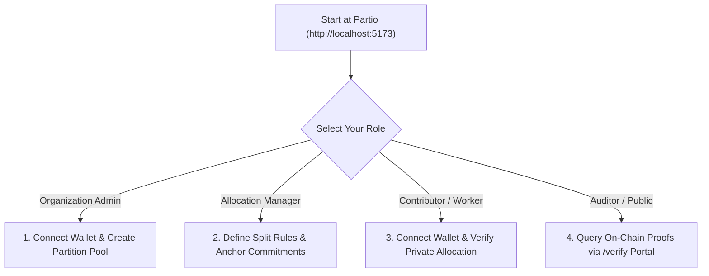

# Partio — Non-Technical User & Operator Guide

> **Document Version:** 1.0.0  
> **Platform Version:** Partio v0.1.0 (Midnight Preprod & Preview)  
> **Target Audience:** Organization Admins, Allocation Managers, Contributors, and External Auditors

---

## 1. Quick Start: Selecting Your Role

Partio provides role-tailored workflows depending on how you interact with the protocol:

---

## 2. Guide for Organization Admins & Treasury Managers

### Step 1: Connect Wallet & Select Network
1. Navigate to **[http://localhost:5173](http://localhost:5173)**.
2. In the top-right corner, click **`Connect Wallet`**.
3. Select **`1AM Wallet`** (or **`Demo Simulator Mode`** if testing without browser extensions).
4. Verify the network badge displays **`Preprod Testnet`** with an active green indicator.

### Step 2: Create a New Compensation Round
1. In the top navbar, click **`Projects`**.
2. Click the green button **`+ Create New Partition Project`**.
3. Fill out the project details:
   - **Project Title:** e.g., `October Contributor Grant Pool`
   - **Total Pool Amount:** e.g., `50000` tNIGHT
   - **Number of Participants:** e.g., `4`
   - **Rule Type:** Click `Percentage`
4. Click **`Deploy Split On-Chain`**.
5. Approve the transaction in your 1AM wallet popup. The pool commitment is anchored on Midnight with status `ACTIVE`.

---

## 3. Guide for Allocation Managers

### Step 1: Configure Distribution Rules
1. Navigate to the **`Splits`** tab in the navbar.
2. Adjust the contributor allocation sliders:
   - **Core Lead:** `35%`
   - **ZK Engineer:** `25%`
   - **Security Auditor:** `25%`
   - **Community Dev:** `15%`
3. Notice the status indicator:  
   `✓ Total: 100% / 100% — Value conservation constraint satisfied`.
4. Click **`Anchor Rules On-Chain`**. The zero-knowledge circuit proves that no funds are leaked, and the status transitions to `DISTRIBUTING`.

### Step 2: Register Eligible Contributor Keys
1. Navigate to the **`Contributors`** tab.
2. Click **`Register Contributor`**.
3. Enter the participant's Midnight wallet address (`mn_addr_preprod1...`) and role.
4. Click **`Save & Register`**. Their public key hash is authorized on the contract registry.

---

## 4. Guide for Contributors & Recipients

### Step 1: Connect Contributor Wallet
1. Open Partio and click **`Connect Wallet`**.
2. Connect with your personal Midnight Preprod address.

### Step 2: Verify Your Private Allocation
1. Click the **`Splits`** tab.
2. Scroll to the **`Live Confidential Partition Stream`** map.
3. Observe that all individual salary figures are shielded (`●●●● tNIGHT`).
4. Click **`Verify My Allocation`**.
5. The in-browser WebAssembly ZK prover evaluates:
   $$A_i \times 100 == \text{TotalPool} \times P_i$$
6. Upon completion, your node updates to **`Proof Verified`** with a green badge, and a cryptographic nullifier is committed to the blockchain.
7. Your coworkers and public observers see that your share is valid, but **never see your salary amount**.

---

## 5. Guide for External Auditors & Governance Committees

### Step 1: Open Independent Verification Portal
1. In the top navbar, click **`Verify`** (direct route: `/verify`).
2. Notice: **No wallet connection or login is required!**

### Step 2: Query On-Chain Proof Receipts
1. Enter the Project ID (e.g. `proj-001-shield-treasury`).
2. Click **`Verify Proof`**.
3. View the on-chain audit receipt:
   - **Status:** `DISTRIBUTING` or `COMPLETED`
   - **Pool Commitment Hash:** Cryptographic fingerprint of the treasury vault.
   - **Verified Contributor Proofs:** Number of verified participants.
   - **Rule Enforcement Type:** Mathematical split model.
4. Click **`Audit Contract State on Midnight Explorer`** to inspect the raw blocks and transaction hashes directly on the ledger.
