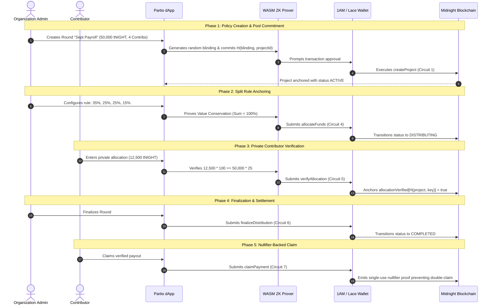

# Partio — System Architecture & Component Blueprint

> **Document Version:** 1.0.0  
> **Platform Version:** Partio v0.1.0 (Midnight Preprod & Preview)  
> **Status:** Production-Ready Architectural Specification

---

## 1. High-Level Architectural Topology

Partio is architected around a multi-tier model separating client-side private enclaves from the Midnight public settlement blockchain:

```mermaid
flowchart TD
    subgraph ClientTier ["Tier 1: Client Application Enclave (Browser / Local RAM)"]
        User["User Interface (React 19 + TypeScript + Vite)"]
        WalletAdapter["Multi-Wallet Adapter (1AM / Lace / Demo Simulator)"]
        LocalWitnesses["Private Witness State Store
        - getPoolAmount()
        - getAllocationAmount()
        - getAllocationPercentage()
        - getBlindingFactor()"]
        WasmProver["Compact WebAssembly Runtime Prover
        (@midnight-ntwrk/compact-runtime)"]
    end

    subgraph ServiceTier ["Tier 2: Middleware & Contract Orchestration"]
        ContractService["SplitShieldContractService
        (@midnight-ntwrk/midnight-js-contracts)"]
        StateHooks["useContractState & useMidnightWallet"]
        IndexerSync["GraphQL Indexer Client (Polling & WebSocket)"]
    end

    subgraph SettlementTier ["Tier 3: Midnight Blockchain Settlement Layer"]
        ImpactVM["Midnight Node & Impact VM Verifier"]
        CompactContract["splitshield.compact (8 Exported Circuits)"]
        PublicLedgerState["Public On-Chain State Maps
        - projectOwners
        - poolCommitments
        - ruleCommitments
        - contributorRegistry
        - allocationVerified
        - distributionStatus"]
    end

    User --> WalletAdapter
    User --> StateHooks
    StateHooks --> ContractService
    ContractService --> LocalWitnesses
    LocalWitnesses --> WasmProver
    WasmProver -->|Proof (π) + Unsigned Tx| WalletAdapter
    WalletAdapter -->|Signed Transaction| ImpactVM
    ImpactVM --> CompactContract
    CompactContract --> PublicLedgerState
    PublicLedgerState --> IndexerSync
    IndexerSync --> StateHooks
```

---

## 2. Component Breakdown

### 1. Client Enclave (`frontend/src/`)
- **React 19 Application:** Built with Tailwind CSS and Framer Motion for 60fps institutional data visualizers.
- **Local Witness Store:** Runs strictly in browser memory. Sensitive inputs ($A_i$, $P_i$, blinding pre-images) never touch disk or network packets.
- **WebAssembly Prover:** Client-side ZK-SNARK proving via `@midnight-ntwrk/compact-runtime`. Average proof generation time: $\sim 670$ ms.

### 2. Wallet & DApp Connector Layer (`frontend/src/hooks/useMidnightWallet.ts`)
- **CIP-30 DApp Connector:** Interfaces with native browser extensions (**1AM Wallet** and **Lace Midnight Edition**).
- **Resilient 5-Stage Address Resolver:** Dynamically queries unshielded, shielded, and DUST gas addresses across v4 and legacy v3 extension APIs.
- **8-Second Polling Recovery Loop:** Prevents transaction drops during background node header synchronization.
- **Demo Simulator Mode:** Pre-funded client-side execution harness using verified Preprod address `mn_addr_preprod1jvc2...` for extension-free evaluation.

### 3. Settlement Smart Contract (`contract/src/splitshield.compact`)
- **Language:** Compact v0.23+.
- **Circuit Budget:** Exactly 8 exported circuits ($\le 10$ budget compliance).
- **Authentication:** Enforces caller authorization via `disclose(ownPublicKey().bytes)`.
- **Value Conservation:** Mathematical constraint ensuring $\sum \text{Allocations} = 100\%$ with zero token leakage.

---

## 3. Data Flow: Complete Compensation Round Lifecycle



---

## 4. Dual Network Topology (Preprod vs Preview)

Partio dynamically configures its RPC, indexer, and contract endpoints based on active user selection:

```
[ Preprod Testnet: wss://rpc.preprod.midnight.network ] ──> Contract: 26a116ed...004ae36e
[ Preview Testnet: wss://rpc.preview.midnight.network ] ──> Contract: ac973a5c...6b1d00a3
```
Swapping networks triggers immediate context re-initialization with zero page refresh.
