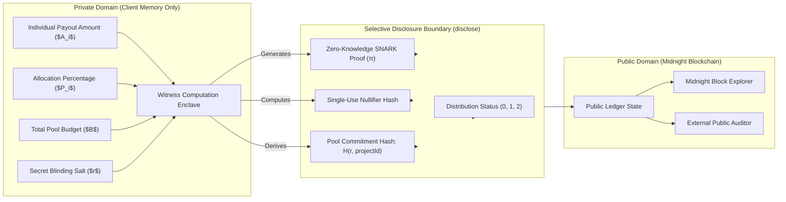

# Partio — Midnight Privacy Model & Selective Disclosure Specification

> **Document Version:** 1.0.0  
> **Platform Version:** Partio v0.1.0 (Midnight Preprod & Preview)

---

## 1. Dual-State Computing Model

Midnight enforces a strict dual-state computing paradigm. Unlike transparent blockchains where all contract state is public, Midnight splits state into:
1. **Private Local State (Witnesses):** Evaluated strictly on the user's machine within client-side WebAssembly RAM.
2. **Public Ledger State:** Anchored globally on the blockchain and verified by network validators.



---

## 2. Information Classification Table

| Data Attribute | Storage Location | Accessibility | Cryptographic Protection |
| :--- | :--- | :--- | :--- |
| **Individual Salary / Compensation ($A_i$)** | Client RAM | Contributor Only | Encrypted in witness state; never written to ledger |
| **Individual Percentage Share ($P_i$)** | Client RAM | Contributor Only | Evaluated inside circuit constraint polynomial |
| **Random Blinding Salt ($r$)** | Client RAM | Organizer Only | 256-bit entropy hiding pool pre-image |
| **Total Pool Budget ($B$)** | Client RAM / Public | Configurable | Concealed via $\mathcal{H}(r, \text{projectId})$ commitment |
| **Project Identifier (`projectId`)** | Public Ledger | Public | 32-byte unique project identifier |
| **Rule Commitment Hash ($H_{\text{rule}}$)** | Public Ledger | Public | SHA-256 fingerprint of agreed split rule |
| **Contributor Registration Hash** | Public Ledger | Public | $\mathcal{H}(\text{projectId}, \text{pubKeyHash})$ |
| **Verification State Flag** | Public Ledger | Public | Boolean indicator that ZK proof verified |
| **Single-Use Nullifiers** | Public Ledger | Public | Prevents replay attacks without revealing keys |

---

## 3. Mathematical Invariants & Zero-Knowledge Assertions

### Invariant 1: Value Conservation ($\sum P_i = 100\%$)
Enforced in Circuit 4 (`allocateFunds`):
```compact
assert(totalPercentage == 100, "Total allocation must equal 100%");
assert(allocationPercentage > 0, "Allocation percentage must be positive");
```
- **Privacy Guarantee:** The circuit proves the organizer apportioned exactly 100% of the funds across registered contributors, without leaking any individual percentage to external observers.

### Invariant 2: Proportional Allocation Match ($A_i \times 100 = B \times P_i$)
Enforced in Circuit 5 (`verifyAllocation`):
```compact
assert(myAllocation * 100 == poolAmount * myPercentage, "Allocation does not match agreed percentage");
```
- **Privacy Guarantee:** Contributor proves their received payment amount mathematically corresponds to their agreed tier percentage of the pool, without publishing either $A_i$ or $B$.

---

## 4. Role-Based Selective Disclosure

1. **Public Observers & Explorers:** Observe the project existence, lifecycle status (`ACTIVE` $\rightarrow$ `DISTRIBUTING` $\rightarrow$ `COMPLETED`), transaction hashes, and proof nullifiers. Cannot deduce individual salaries.
2. **Contributors:** View their own private allocation and verification receipt. Cannot inspect peer allocations.
3. **Authorized Auditors (via `/verify`):** Can independently query on-chain commitment hashes and verified proof tallies without requiring organizer private keys.
